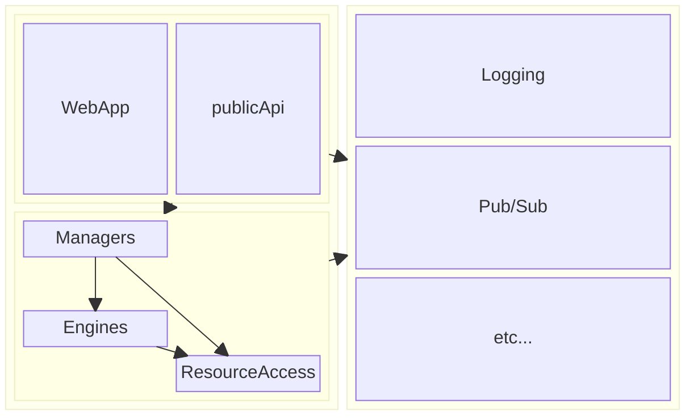

# Framework Concepts
Frameworks are a touchy subject for many architects.  I'm in the "Frameworks can be good, but let's be sensible" camp.

Many Frameworks get into trouble when the Domain leaks into what should be code that enforces architectural policy and facilitates standard patterns, etc...

SOMETIMES, we DO have concepts or idioms that descend from the Domain and SHOULD be made readily available to all components within a system.

Amongst the "Frameworks are OK" camp, there's a belief that we can actually LAYER our Frameworks.

The Base, low-level framework provides those standardized, domain agnostic patterns, and this should be adopted for any solution or system built upon that framework.  Then, when needed, we can add the organizational "Domain Framework" library alongside it.

I plan to have both types of Framework in this solution.

## ThatDeveloperDad.iFX
This is my "base" or low-level framework.  I set out the System's Component model in this assembly.  It's in here that I define the kinds of components my system can include (Service Archetypes,) and set up the construction patterns for those components.

Before we get too far, I should explain the different kinds of dependencies we're going to be dealing with.

We have platform provided dependencies.  These items come from the .Net Core Framework itself, or third party libraries that we import for specific needs.

Then, we have System Dependencies.  These are components that we create within the solution and its projects.

The dependency management code in ThatDeveloperDad.iFX deals only with those *System Dependencies*.

### Why split them up?  That seems unnecessarily complicated.
Honestly?  I don't particularly care for the Dependency Injection patterns built into .Net Core.  Don't get me wrong; they're effective, and they do the trick quite nicely!  

My issue with the built-in DI implementation is that while it DOES give us Inversion of Control within our classes, it does very little to promote or protect the kind of Closed Architecture that I consider to be "The only sane way" to build a system of any complexity.

For "platform-level" or "cross-cutting concerns" dependencies, the DI framework built into .Net Core is fine.  If we want Logging in every component, and we want to use the same Logging patterns across every component, the existing DI is sufficient, though we'll run into some trouble when we start making our components responsible for initializing their own dependencies.

### About this "Closed" architecture
This concept revolves around sorting composing a system from discrete, independent components that each fall into one of five Service Archetypes.  This gives us a *Taxonomy* that we can apply to the different Services or Classes in our systems and applications.

 * Client  
Clients expose use cases / features of our systems to the outside world, making them available for human and machine-based usage.
   * User Interfaces
   * Published APIs  
 * Manager  
A Manager component is the unit of composition.  A Manager CONSTRUCTS the use cases delivered by our system by integrating Engines and Resource Access, and contains the "Flow-Control" logic that decides which component gets invoked when.
 * Engine  
 Engines contain hard logic.  Calculations, Transformations, Decisions, Complex Object Construction, these are all examples of activities that should be considered "Engine" functionality.
 * ResourceAccess  
 These components are responsible for storage and retrieval of the "things" that our systems operate upon.  Records in a Database, Files in Storage, objects controlled by external APIs, and IoT devices are all examples of Resources.
 * Utility  
 Utility components are capabilities that are used by the other components in the system to perform basic technical tasks.  Think about Logging, Pub/Sub messaging, Rule Evaluation, etc...

The taxonomy looks like this:  

 A Taxonomy is useful for conversation, but to make practical use of these classifications, we need to introduce an Ontology across them.  These rules are what gives us that Closed Architecture I'm talking about.

  * Clients  
  Initiate the Use Cases.  No other component in our system can trigger a Use Case.  
  These use cases are provided by Manager components.    
  Therefore:  Clients may have dependency on Managers or Utilities.
  * Managers
  Provide Simple Use Cases.  
  A Use Case is a series of conditionally executed Tasks.
  These Tasks are implemented by Engines or ResourceAccess components.
  A Use Case MAY NOT include another Use Case as a Required Step.
  Therefore:  Managers may have dependencies on Engines, ResourceAccess, or Utilities.
  * Engines  
  Implement Compute Steps that are used when executing Use Cases.  
  An Engine may sometimes require access to some Resources.  
  Engines MAY NOT trigger Use Cases, nor may engines use other Engines.  
  Therefore:  Engines may have dependencies on ResourceAccess or Utilities.
  * Resource Access  
  Provide access to Entities of Interest within the wider System Context.  
  Hide the technical mechanisms by which these Entities are stored and retrieved.  
  MAY NOT invoke Compute; MAY NOT invoke Use Cases.  
  Therefore:  Resource Access components may have dependencies only on Utilities.

### That seems nice & tidy & logical.  So how do we make sure it gets followed?  And how do we preserve Inversion of Control?  
Simply, each component becomes responsible for its own dependencies.  

#### Abstractions
To accomplish this, we need to make sure that each component implementation is programmed against a CONCEPTUAL representation of its dependencies. 

If you look at the project structure for DevDad.SaaSAdmin, you'll see that the ResourceAccess projects are split:  For each of those components, there's a project that contains the Abstractions (that Conceptual representation.)

These Abstractions projects contain the description of the Steps that the component can perform along with definitions of the data that the component expects to receive. Abstraction projects also provide definitions of the data that can be expected when a Step has completed.

In C#, we call these code artifacts "Interfaces" for behavior, and (usually,) Classes for the data descriptions.  I've always preferred the terminology used by WCF way back when, and like to call these "Contracts".

Interfaces conceptually map to ServiceContract.  
Individual behavors (methods) declare on Interfaces map to OperationContract.  
The classes passed as parameters map to DataContract.  

#### Implementations
 Alongside the Abstraction for the components, we'll have one or more implementation projects, which provide the behavior described in the Abstractions for the component, coded to use a specific technology.  
 
 For instance, the RulesAccess concept will be implemented against Azure Table Storage in this manifestation of the system.  I've created a DevDad.SaaSAdmin.RulesAccess.AzureTableProvider project that will deliver the functionality DESCRIBED IN the ...Abstractions project.

 My AccountManager class doesn't know anything about Azure Tables, it knows only that it can LoadRules from a RulesAccess component.

 ### This is all very fundamental and theoretical.  I need to instantiate those concrete THINGS so my application can do the STUFF!!!!
 I get it.  You're used to Interface=>Class type thinking already, from using the built in .Net DI extensions, and that works nicely for smaller, tightly scoped projects.  As applications evolve though, the temptation to share dependencies between sub-domains expressed in your application gets stronger and stronger, until you've got another big tangled mess on your hands.

 That's why I dont' like registering concrete implementations of my "inner" system components in the "Root" Program.cs file.

 We do need a way, however, to tell our components where to "find" the particular dependency implementations we want to use, without forming hardened references to the implementation projects.
